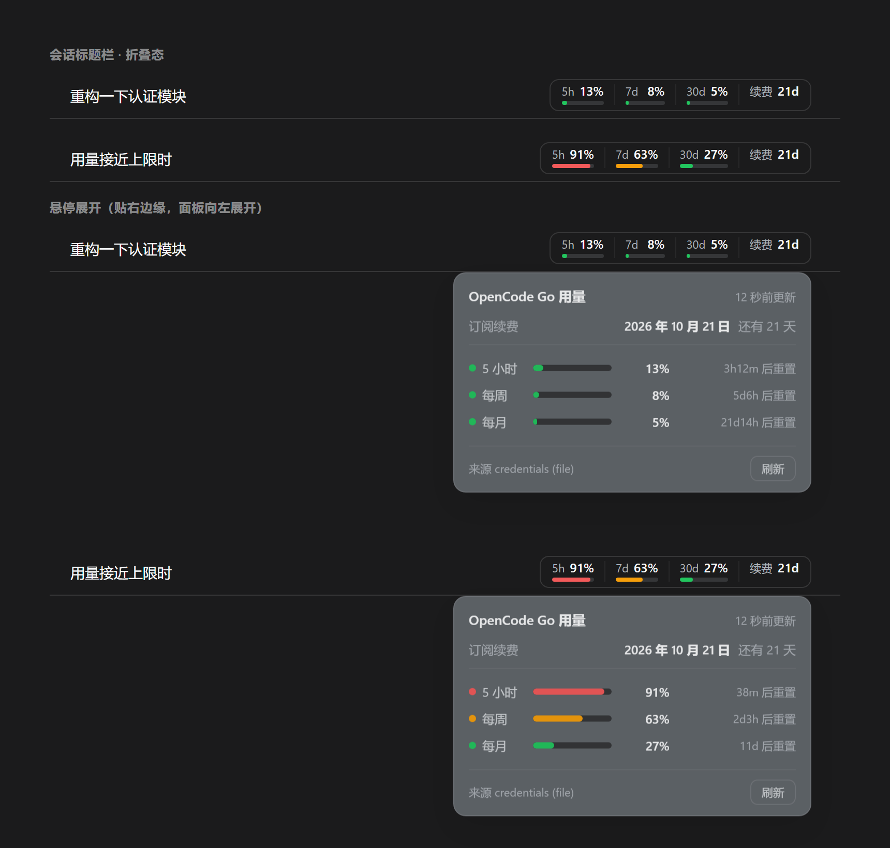

# dsh-opencode-go-usage

在 DSH 的**会话头部**常驻显示 OpenCode Go 套餐用量：**5 小时滚动 / 每周 / 每月**三个窗口的百分比，
外加**订阅还有几天续费**；悬停展开各自的**重置倒计时**和**续费日期**。

> English: [README.en.md](README.en.md)

## 它解决什么

用 OpenCode Go 写代码时，那些百分比和续费日期只在浏览器后台页面里看得到——你得切出去、刷新、再切回来。
这个插件把它钉在你会话标题栏的右上角，一直更新：

```
● 5h 11%   ● 7d 7%   ● 30d 4%   续费 21d
```

- **颜色**：绿 < 50%，琥珀 50–80%，红 ≥ 80% 或 `rate-limited`；每个窗口下面有一条对应的进度条
- **续费倒计时**：末尾那一段是**订阅还剩几天续费**。它**故意没有进度条**——那个"缺条"就是信号，
  告诉你这数字和旁边三个百分比不是一类东西
- **鼠标悬停就展开详情**（不用点）：最上面一行是**订阅续费**（完整日期 + 还有几天），
  下面三个窗口各一行 —— 进度条 + 百分比 + 各自的"还有多久重置"；底部是数据来源和刷新按钮
  - **点一下可以钉住**面板，方便去点刷新按钮；鼠标移开、点面板外、或按 Esc 收起
- **实时**：host 每 60 秒轮询一次上游，浏览器每 60 秒取一次；倒计时每秒本地走字，不额外发请求

### 续费时间是怎么算出来的

不是猜的，是**从上游返回的 monthly 窗口反推**的。

OpenCode 控制台用 `getMonthlyBounds(now, subscribed)` 算月度窗口，而它是**锚定在订阅日**上的
（UTC 的几号 + 几点几分几秒），返回的 `end` 就是下一次周年日——也就是接口返回的 `monthly.resetsAt`。
月度套餐的配额周期和计费周期本来就是同一个区间，所以后台页面上 "Renews in …" 和
"Monthly usage resets in …" 显示的是**同一个倒计时**，这也印证了这一点。

host 把它单独暴露成 `subscription` 字段，并把还原出的锚点一并给出：

```json
"subscription": {
  "renewsAt": "2026-10-21T07:57:29.000Z",
  "anchorDayOfMonth": 21,
  "anchorTimeUtc": "07:57:29"
}
```

**能拿到什么、拿不到什么**：能拿到**下一次**续费/到期的确切时刻，也能还原出"每月几号几点"这个规律；
但**拿不到当初是哪个月开通的**——接口不暴露那个，它只在需要登录的后台里。

## 安装

```sh
dsh plugin --profile <你的 profile> add github:to4511543-cmd/dsh-opencode-go-usage
```

> **`<你的 profile>` 填什么？** 打开 `C:\Users\<你的用户名>\.dsh\profiles\`（macOS / Linux 是 `~/.dsh/profiles/`），
> **里面的文件夹名就是 profile 名**。用桌面版 App 的通常是 `desktop`，用 `dsh web` 命令行的通常是 `web`。
>
> 填错了不会弄坏什么，只是装到了另一个 profile 上——换回正确的名字再装一次即可。

装完**硬刷新**页面（**Ctrl+Shift+R**，普通 F5 不够——客户端 bundle 带 `immutable` 缓存头）。



> 上图由 `npm run preview` 生成：它把插件自己的样式表从 `lib/client.js` 里抽出来，
> 叠加 DSH 真实的主题变量，渲染成静态页面再截图。所以它就是实际渲染结果，不是示意图。

### 不想用 git？离线装

下载仓库 zip，解压到 `~/.dsh/plugins/dsh-opencode-go-usage`，然后：

```sh
dsh plugin --profile <你的 profile> add link:C:/Users/<你>/.dsh/plugins/dsh-opencode-go-usage
```

> Windows 上路径写**正斜杠**。`link:` 装的是软链接，所以以后你直接改那个目录里的文件即可，
> 不用重装。

> 仓库里已经提交了可直接运行的 `lib/`，也**没有任何 `prepare` / `postinstall` 生命周期脚本**，
> 所以这条命令不编译任何东西，也不会撞上 pnpm 的 `allowBuilds` 构建授权。

## API key 从哪来

host 半边按下面顺序找 key，**第一个找到的生效**：

| 顺序 | 位置 |
|---|---|
| 1 | `ctx.credentials.resolve('OPENCODE_GO_API_KEY')` —— **DSH 自己的凭据服务**（推荐，也是默认命中的那条） |
| 2 | 环境变量 `OPENCODE_GO_API_KEY` —— 只有你在**启动 DSH 之前** export 过才会有 |
| 3 | 直读 `~/.dsh/.credentials.yaml` 的 `refs.OPENCODE_GO_API_KEY` —— 兜底 |
| 4 | `~/.dsh/opencode-go-usage/key.txt`（纯文本，只有 key 一行） |

> 第 1 条是**每次轮询都重新解析**的，不缓存——所以你在别处换了 key，**不用重启就生效**。
> 第 3 条是直读文件，只在凭据服务不可用时兜底：它没有文件锁、不处理格式迁移，也跳过优先级规则。

> **key 永远不会到浏览器**：客户端只读插件自己的本地路由，不直接请求 opencode.ai。
> 也因此，同时开 N 个标签页只会产生一份上游轮询。

你是通过 DSH 的凭据系统配的 OpenCode Go（`apiKeyEnv: OPENCODE_GO_API_KEY`），
那第 1 条就已经能用了，**不需要额外配置**。

## 可选环境变量

| 变量 | 默认 | 说明 |
|---|---|---|
| `DSH_OPENCODE_GO_USAGE_INTERVAL_MS` | `60000` | 轮询间隔，低于 30000 会被忽略 |
| `DSH_HOME` | `~/.dsh` | DSH 状态目录，影响上面第 2、3 条的查找位置 |

## 数据来源与风险（请读）

百分比来自这个接口：

```
GET https://opencode.ai/zen/go/v1/usage
Authorization: Bearer <key>

{"usage":{"rolling":{"status":"ok","percent":11,"resetsAt":"..."},
          "weekly": {"status":"ok","percent":7, "resetsAt":"..."},
          "monthly":{"status":"ok","percent":4, "resetsAt":"..."}}}
```

**它不在 OpenCode 的官方文档里。** 这个路径是从 OpenCode 控制台自己的源码里读出来的
（`packages/console/app/src/routes/zen/go/v1/usage.ts`），并用真实请求确认过 200 与字段名。
后果是：

- 上游随时可能改形状或下线，**没有任何稳定性承诺**
- 所以本插件对返回**逐字段防御性解析**：缺字段显示 `—`，HTTP 错误显示原文，**任何异常都不会抛出**——
  一个用量徽章不该有能力弄坏你的会话头部
- 轮询间隔有 30 秒下限，60 秒是默认值：尊重上游，一个 5 小时窗口不需要秒级分辨率

### 数字对不上后台页面？

两个已知差异，都不是 bug：

1. **接口返回整数，后台页面保留一位小数。** 上游对百分比取 `Math.floor`，控制台前端用
   `Math.round(x*10)/10`。所以可能显示 `34.7%` 而接口给 `34`。
2. **百分比是相对各自窗口的，不是相对整个月。** 按 Go 的额度设计，5 小时窗口 = 月额度的 20%、
   每周 = 50%、每月 = 100%。所以 `rolling.percent: 100` 意思是"这 5 小时用掉了月额度的 20%"，
   不是"全用完了"。

## 排错

| 现象 | 处理 |
|---|---|
| 头部没有徽章 | **Ctrl+Shift+R** 硬刷新；再看插件是否在该 profile 的 `dsh.profile.bundles` 里 |
| 徽章显示 `—` | 打开详情面板看错误原文；多半是 key 找不到或上游改版 |
| 显示 `HTTP 401` | key 无效或已撤销，重新 `opencode auth login opencode` |
| 显示 `HTTP 403` | 该 key 所属账号没有 OpenCode Go 订阅 |
| 数字不动 | host 每 60 秒才轮询一次；点详情面板里的**刷新**可以强制立刻拉一次 |

直接看 host 侧状态：

```sh
curl http://127.0.0.1:<dsh 端口>/opencode-go-usage/status.json
curl -X POST http://127.0.0.1:<dsh 端口>/opencode-go-usage/refresh   # 强制刷新
```

## 开发

**这个仓库没有构建步骤。** `lib/index.js` 和 `lib/client.js` 就是可直接运行的产物：

- `lib/index.js` 是普通 ESM，只 import Node 内置模块
- `lib/client.js` 是手写的 `window.__ModuleLoader__.load({ id, factory })` 外壳，
  里面用 `react.createElement`，没有 JSX、没有 TypeScript

改完直接生效，不需要 `npm run build`——这也是它能从源码安装而不触发构建授权的原因。

自检（都不需要装依赖）：

```sh
node scripts/verify-client-boot.mjs        # 客户端不会挂起 GUI 的断言
node scripts/verify-host.mjs               # host 路由与错误处理（离线，fetch 被打桩）
node scripts/verify-host.mjs --live        # 真打 opencode.ai，需要能解析到 key
```

`verify-client-boot.mjs` 断言的东西值得说明：客户端加载器把**任何不是 `active` 的条目**当成致命错误
（`web boot: N entry did not activate`），于是**整个 GUI 打不开**。静态 `inject` 一旦声明了宿主给不出的服务，
本插件 fiber 就永远 `pending`。所以脚本直接断言产物里**没有静态 `inject`**，
并且 `slots` 缺席时 `apply()` 必须**静默闲置**而不是抛错。

## 许可

MIT，见 [LICENSE](LICENSE)。
